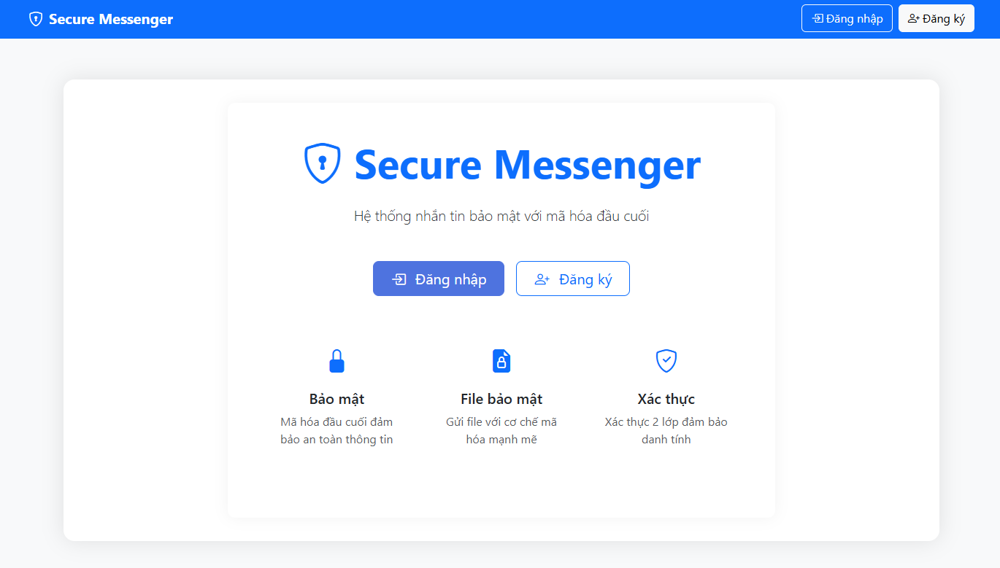
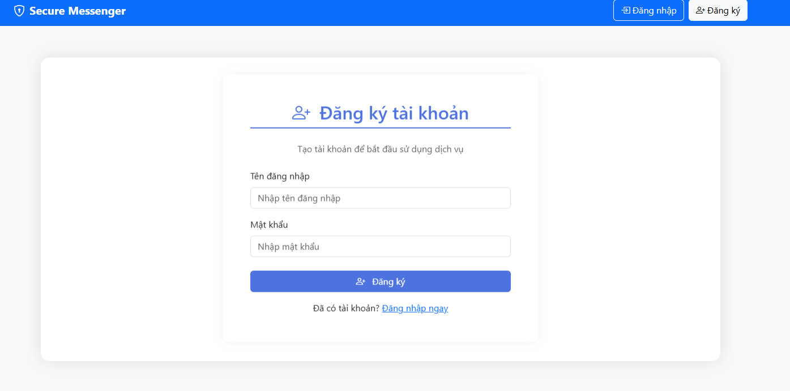
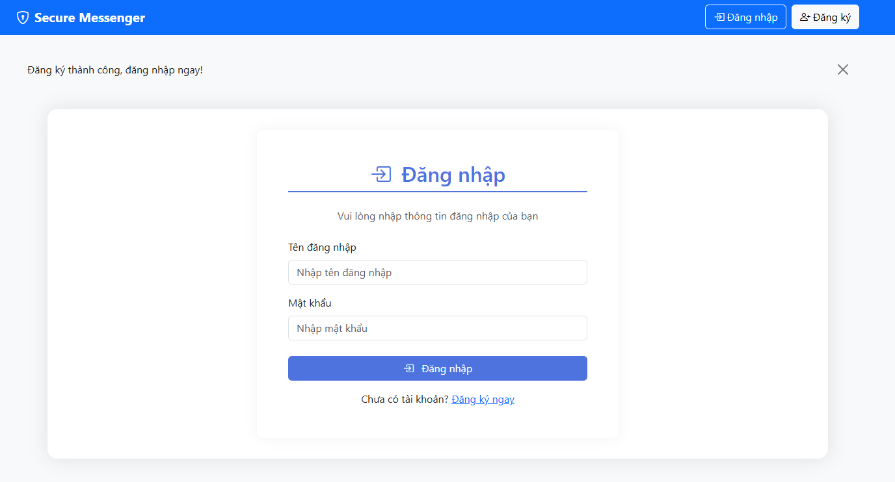
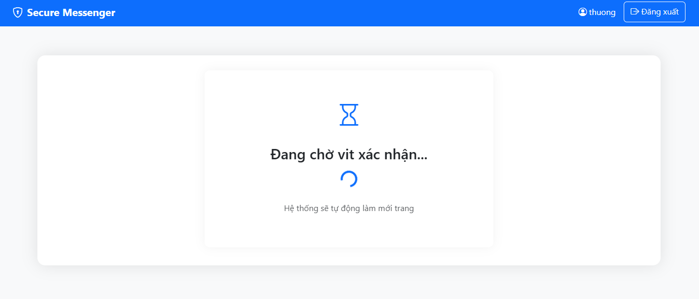
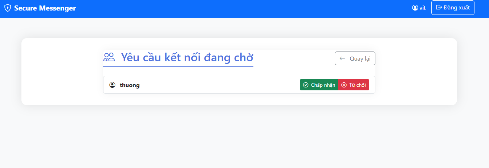
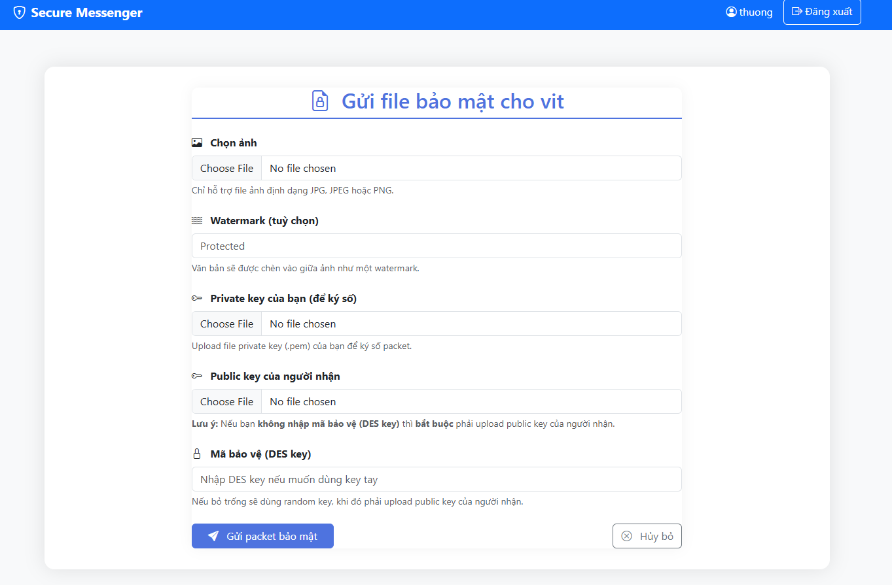
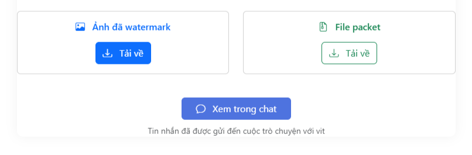
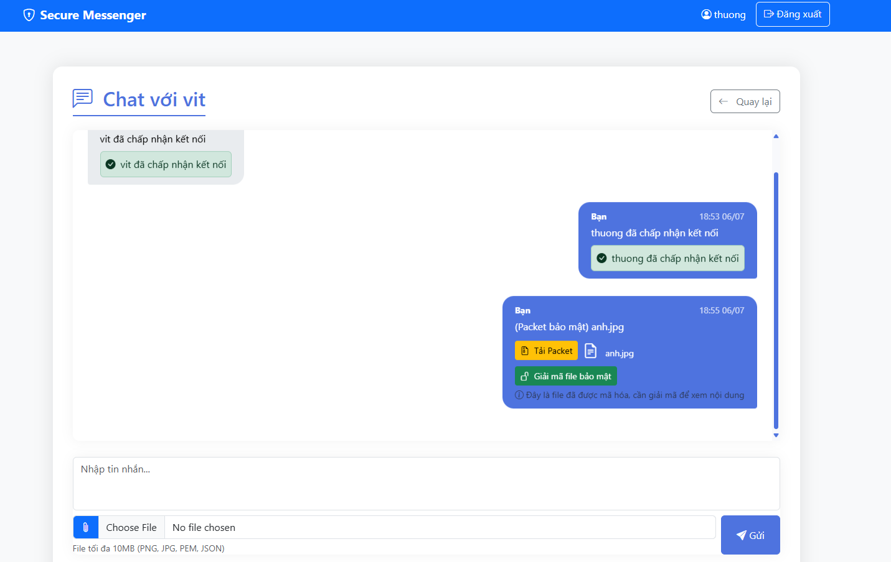
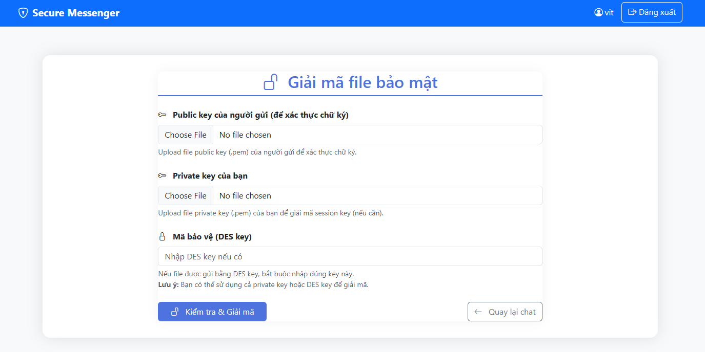
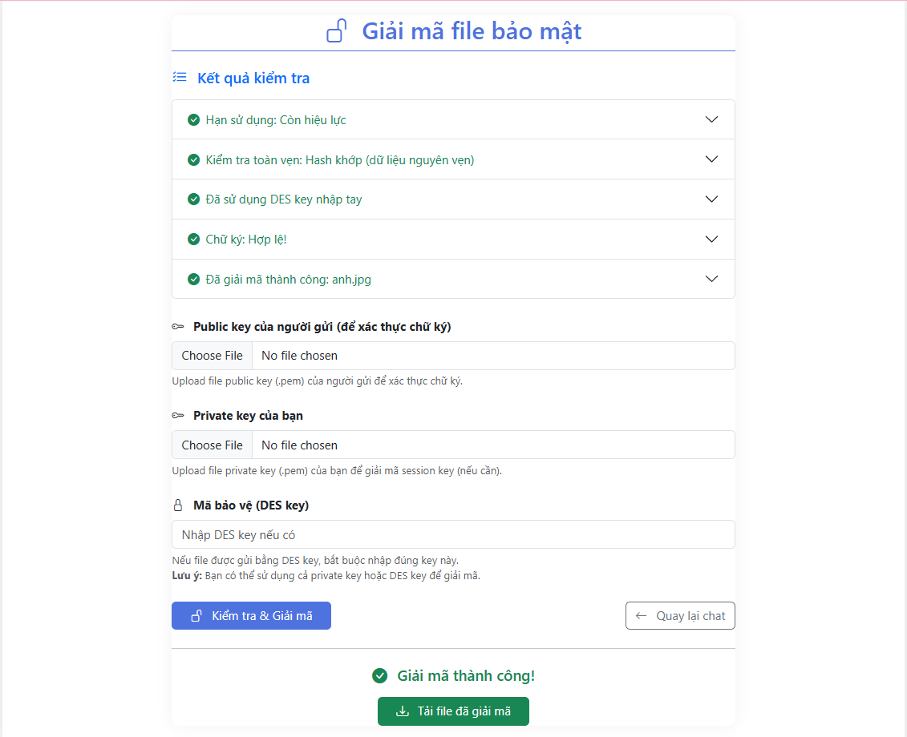

# 🔐 Hệ thống Gửi Ảnh Bảo Mật Gắn Watermark

<p align="center">
  
  
</p>

<div align="center">

[](https://dainam.edu.vn/vi/khoa-cong-nghe-thong-tin)
[](https://dainam.edu.vn)

</div>

## 📌 Giới thiệu
Dự án này xây dựng một hệ thống **web bảo mật** bằng Python & Flask, cho phép **gửi ảnh gắn watermark** với các cơ chế bảo vệ hiện đại:
- Ảnh được **mã hóa bằng DES** (khóa phiên sinh ngẫu nhiên hoặc nhập tay).
- **Session key** bảo vệ bằng **RSA 2048-bit** (trao đổi khóa an toàn).
- **Ký số metadata** bằng RSA/SHA-512 để xác thực nguồn gốc.
- **Kiểm tra toàn vẹn** file bằng SHA-512 (hash) và xác thực chữ ký số.
- Chỉ người nhận hợp lệ mới có thể **giải mã, xác thực, tải về** ảnh gốc.

## 🧠 Công nghệ sử dụng

| Thành phần        | Mô tả                                      |
|-------------------|--------------------------------------------|
| **Python 3.10+**  | Ngôn ngữ lập trình chính                   |
| **Flask**         | Web framework                              |
| **PyCryptodome**  | Thư viện mã hóa DES, RSA, SHA-512          |
| **Jinja2**        | Template HTML                              |
| **SQLite**        | Lưu thông tin user, tin nhắn, handshake    |
| **Bootstrap**     | Giao diện hiện đại, dễ sử dụng             |

## 🎯 Tính năng chính

- ✅ Đăng ký, đăng nhập tài khoản bảo mật
- ✅ Sinh & quản lý cặp khóa RSA 2048-bit (tải về/tải lên)
- ✅ Gửi yêu cầu handshake để trao đổi khóa
- ✅ Gửi ảnh có gắn watermark, mã hóa bảo mật
- ✅ Ký số metadata file và xác thực chữ ký khi nhận
- ✅ Kiểm tra toàn vẹn nội dung (SHA-512 hash)
- ✅ Giao diện: chat, gửi/tải file, hiển thị trạng thái xác thực
- ✅ Lưu log hoạt động, phản hồi rõ ràng mọi thao tác

## 🔐 Quy trình bảo mật

1. **Handshake**: Người gửi & nhận xác nhận kết nối.
2. **Ký số metadata**: Người gửi ký metadata bằng **private key** RSA/SHA-512.
3. **Bảo vệ session key**:  
    - Nếu nhập tay: chỉ người nhận biết.
    - Nếu không: session key được **mã hóa bằng public key của người nhận**.
4. **Mã hóa ảnh bằng DES**: Ảnh và watermark được mã hóa với session key, IV ngẫu nhiên.
5. **Tính hash toàn vẹn**: SHA-512(iv + cipher + expiration).
6. **Gửi packet JSON**: Gửi metadata, signature, cipher, iv, session_key, hash.
7. **Người nhận kiểm tra**:  
    - Hạn sử dụng.
    - Toàn vẹn (hash).
    - Giải mã session key (private key hoặc nhập tay).
    - Kiểm tra chữ ký số (public key người gửi).
    - Giải mã và tải file ảnh nếu hợp lệ.

## 🧪 Thử nghiệm

- Ảnh gửi nhận với watermark bảo vệ rõ ràng.
- Chỉ người nhận đúng mới giải mã, xác thực và tải về.
- Bất kỳ thay đổi nội dung hay file đều bị phát hiện.
- Mọi trạng thái đều có phản hồi: hợp lệ, sai key, sai chữ ký, hết hạn...

## 📂 Cấu trúc thư mục

```
📁 project_root/
├── app.py # Flask App chính
├── crypto_utils.py # Tiện ích mã hóa, ký số, xác thực
├── models.py # Định nghĩa các bảng User, Message, Handshake
├── templates/ # HTML giao diện (Flask, Bootstrap)
│ ├── base.html
│ ├── chat.html
│ ├── send_packet.html
│ ├── decrypt_packet.html
│ └── ...
├── uploads/ # Lưu file upload, file packet, file giải mã
├── requirements.txt # Thư viện cần thiết
```

## 🚀 Chạy ứng dụng

### 1. Cài thư viện:
```bash
pip install -r requirements.txt
```

> File `requirements.txt` gồm:
```
flask
pycryptodome
flask-login
flask-sqlalchemy
```

### 2. Chạy server:
```bash
python app.py
```

Trình duyệt sẽ tự mở trang: [http://127.0.0.1:5000]


## 🎨 Giao diện hệ thống

Hệ thống gồm các giao diện chính:
### 1. **Giao diện khi chưa đăng nhập**
- Hiển thị giới thiệu qua trang web và hướng tới chức năng đăng ký, đăng nhập.

   

### 2. **Giao diện đăng ký / đăng nhập**
- Người dùng có thể đăng ký tài khoản mới hoặc đăng nhập vào hệ thống.
- Kiểm tra tên đăng nhập trùng lặp, báo lỗi khi sai mật khẩu.
- Đăng ký:
   
- Đăng nhập:
   


### 3. **Trang chủ (Dashboard)**
- Hiển thị danh sách người dùng có thể chat/gửi file, các thông báo, trạng thái yêu cầu kết nối.
- Truy cập nhanh tới các tính năng: gửi file bảo mật, tạo/cập nhật khóa, đăng xuất.
  

### 4. **Giao diện bắt tay (Handshake)**
- Gửi yêu cầu kết nối tới người nhận, chờ xác nhận.
   
- Người nhận duyệt hoặc từ chối handshake.
   

### 5. **Giao diện gửi packet mã hóa**
- Nhập Private Key của mình để ký số, Public Key của người nhận để mã hóa khóa DES (nếu cần), mã DES, watermark.
   
- Có nút tải ảnh đã watermark, nút tải file packet.
   

### 5. **Giao diện chat**
- Nhắn tin hai chiều, trao đổi khóa Public Key ở đây, packet mã hóa sẽ được gửi về đây
- Có nút tải file các tin nhắn được gửi đi nếu là ảnh hoặc packet.
   

### 6. **Giao diện giải mã và kiểm tra toàn vẹn**
- Upload private key hoặc nhập DES key để giải mã.
   
- Kiểm tra các bước: hạn dùng, hash toàn vẹn, session key, chữ ký số, loại file.
- Hiển thị rõ trạng thái từng bước (thành công/thất bại), cho phép tải về file giải mã.
   

## 🔧 Đề xuất nâng cấp

- 📱 Thêm xác thực đa yếu tố (2FA, OTP)
- 🔒 Tích hợp HTTPS (Let's Encrypt)
- 🗄️ Chuyển sang PostgreSQL/MySQL cho dữ liệu lớn
- 🧠 Giao diện mobile/web hiện đại hơn
- 📊 Thêm dashboard thống kê, kiểm soát quyền admin

## 📚 Tài liệu tham khảo

1. **PyCryptodome Documentation**  
   [https://www.pycryptodome.org/src/installation](https://www.pycryptodome.org/src/installation)

2. **Flask Documentation**  
   [https://flask.palletsprojects.com/](https://flask.palletsprojects.com/)

3. **RSA Algorithm – Wikipedia**  
   [https://en.wikipedia.org/wiki/RSA_(cryptosystem)](https://en.wikipedia.org/wiki/RSA_(cryptosystem))

4. **Digital Signature – Wikipedia**  
   [https://en.wikipedia.org/wiki/Digital_signature](https://en.wikipedia.org/wiki/Digital_signature)

5. **DES (Data Encryption Standard) – Wikipedia**  
   [https://en.wikipedia.org/wiki/Data_Encryption_Standard](https://en.wikipedia.org/wiki/Data_Encryption_Standard)

6. **SHA-2 (SHA-512) – Wikipedia**  
   [https://en.wikipedia.org/wiki/SHA-2](https://en.wikipedia.org/wiki/SHA-2)

7. **OWASP Top 10 – Web Security**  
   [https://owasp.org/www-project-top-ten/](https://owasp.org/www-project-top-ten/)

8. **Let's Encrypt – Hướng dẫn HTTPS miễn phí**  
   [https://letsencrypt.org/](https://letsencrypt.org/)

9. **Python Imaging Library (Pillow) – Watermark**  
   [https://pillow.readthedocs.io/en/stable/reference/ImageDraw.html](https://pillow.readthedocs.io/en/stable/reference/ImageDraw.html)

10. **Bootstrap Documentation (giao diện)**  
    [https://getbootstrap.com/docs/5.0/getting-started/introduction/](https://getbootstrap.com/docs/5.0/getting-started/introduction/)
